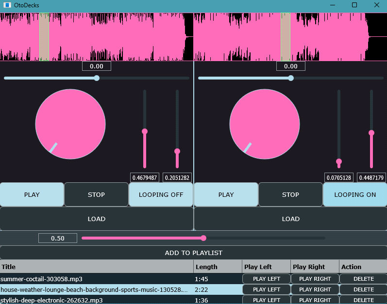

# OtoDecks: A Two-Deck DJ Application in C++

*A desktop DJ application built with the JUCE audio framework. Two independent decks for simultaneous playback, a track playlist for queueing, stereo panning beyond the assignment baseline, and a custom rotary control built on top of the framework's drawing primitives.*

---

## TL;DR

Built OtoDecks, a desktop DJ application in C++ using the JUCE audio framework. Two independent decks each play audio with their own waveform display, transport controls, and speed, volume, and position adjustment. A track playlist below the decks can load any track into either side with one click. Beyond the assignment baseline I added stereo panning, a dynamic looping toggle, a crossfader for blending the two decks, and a custom rotary knob for the speed control. The audio side was new territory. The OOP work was where most of the lessons actually landed.

**Stack:** C++, JUCE framework
**Scope:** A desktop application coordinating two independent audio players, a playlist with per-track routing to either side, and a fully customised interface.
**Context:** Object-Oriented Programming module, BSc Computer Science (University of London)

## Code access

Source code, JUCE project files, and the technical report live in a private repository. Happy to share full access with recruiters or hiring managers on request.

---

*The finished app. Hot pink waveforms at the top with a light-green playhead cursor, two decks with rotary speed knobs and vertical sliders for volume and position, dynamic loop buttons (this screenshot caught one in each state), a crossfader in pink at the bottom, and the playlist with per-track buttons to send a track to either deck.*
